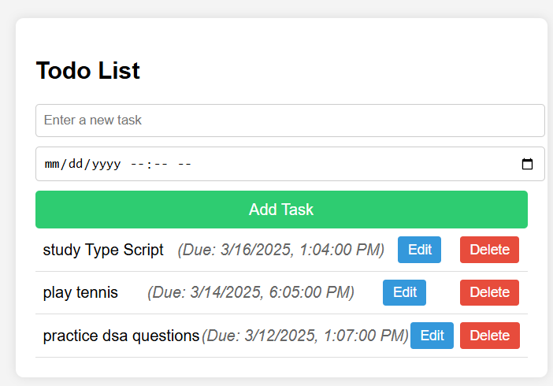
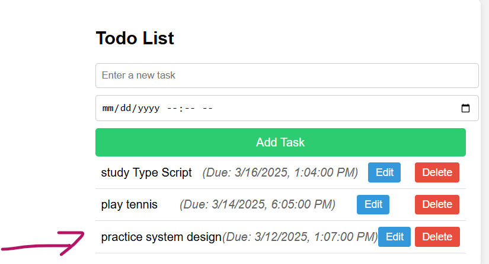
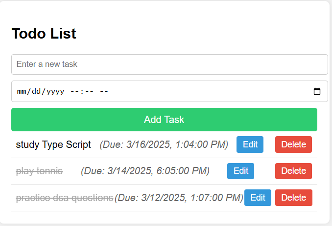
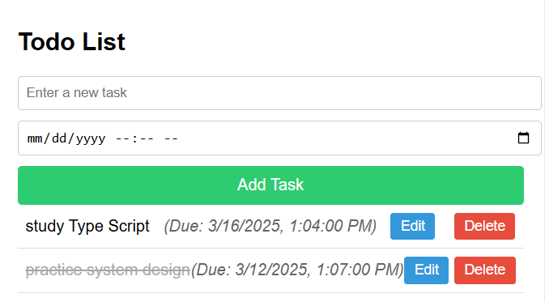

# Todo List Application

## Description
This is a simple Todo List application built using HTML, CSS, and JavaScript. It allows users to:

- Add new tasks
- Edit existing tasks
- Mark tasks as completed
- Delete tasks
- Save tasks across sessions using **local storage**
- Set and track **due dates** for tasks

## Folder Structure

/todo-list-app ├── index.html ├── style.css └── script.js

## How to Run the Application
1. Download or clone the repository.
2. Open the `index.html` file in a web browser.
3. Enter a task in the input field and click the "Add" button to add it to the list.
4. Click the "Edit" button to modify a task.
5. Click on a task to mark it as completed.
6. Click the "Delete" button to remove a task.

## Technologies Used
- HTML
- CSS
- JavaScript

## Features
- **Add Tasks**: Enter a task and click the "Add" button to include it in the list.
  

- **Edit Tasks**: Modify an existing task by clicking the "Edit" button.
  

- **Mark as Completed**: Click on a task to toggle its completion status. Completed tasks will appear with a line-through.
  

- **Delete Tasks**: Remove a task using the "Delete" button.
  

## Future Enhancements
- Implement **local storage** to save tasks across browser sessions.
- Add **task categorization** for better organization.
- Introduce a **due date** feature to set deadlines for tasks.

## License
This project is open-source and free to use.
